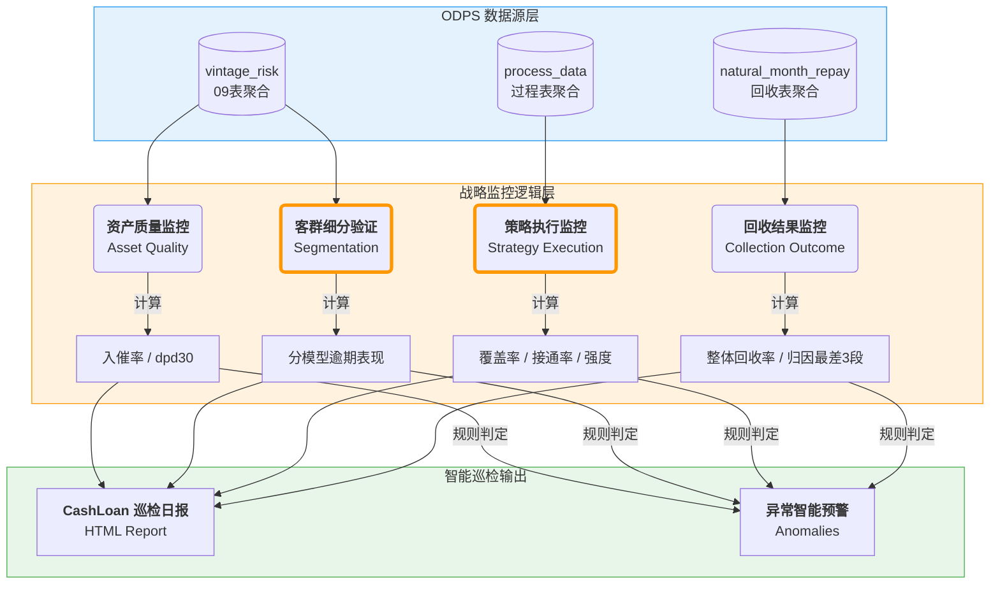

# 贷后数据巡检 (Collection Inspection) - Project Wiki

> **Central Knowledge Base** for the Collection Inspection Agent.  
> **Maintainer**: Mr. Yuan

---

## 🗺️ 业务架构 (Business Architecture)

---

## 📚 目录 (Table of Contents)

### 1. 业务设计 (Business Design)
- **[01_Business_Design.md](01_Business_Design.md)**: 项目目标、战略监控维度（资产/执行/回收/客群）、异常判定规则。
- **[02_Report_Spec.md](02_Report_Spec.md)**: 日报内容设计、KPI 定义、HTML 结构规范。
- **[07_Business_Sense.md](07_Business_Sense.md)**: 业务 sense 汇总（先 CashLoan 再扩展、话术示例、指标速查、结论模板、数据与报表现状）。
- **[09_Metrics_Coverage.md](09_Metrics_Coverage.md)**: 指标覆盖度与待补清单（PTP/RPC/迁徙率等欠缺项）。

### 2. 技术架构 (Technical Architecture)
- **[04_Technical_Arch.md](04_Technical_Arch.md)**: 脚本逻辑 (`run_cashloan_report.py`)、聚合策略 (`*_agg.sql`)、文件依赖关系。
- **[06_Data_Dictionary.md](06_Data_Dictionary.md)**: 关键表结构说明 (Vintage, Process, Repay)。

### 3. 操作手册 (Operations)
- **[03_Operations_Manual.md](03_Operations_Manual.md)**: 如何下载数据 (943)、如何本地运行日报、故障排查。

### 4. 进度与规划 (Roadmap)
- **[05_Roadmap.md](05_Roadmap.md)**: 当前状态、待办事项、未来规划。

### 5. 决策与过程记录 (Decision Log)
- **[08_Decision_Log.md](08_Decision_Log.md)**: 文档迭代顺序（先做 3 和 4）、其他关键决策与过程记录。

---

## 🚀 快速开始 (Quick Start)

1. **下载数据**: 参照 [03_Operations_Manual.md](03_Operations_Manual.md) 使用 `download_agg_only.py`。
2. **生成日报**: 运行 `run_cashloan_report.py`。
3. **查看结果**: 打开 `reports/` 下的 HTML 文件。

---

**Last Updated**: 2026-02-03  
**维护者**：Mr. Yuan
